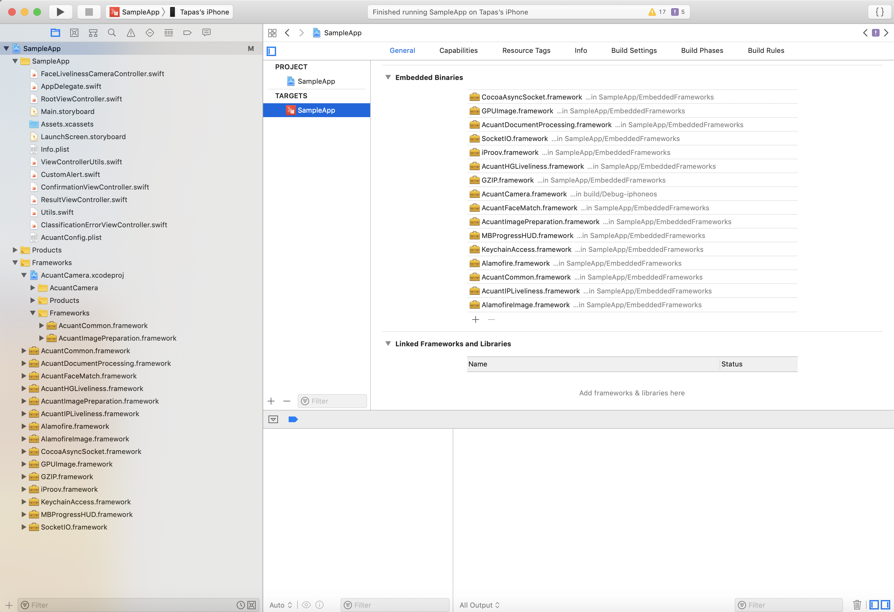

# Acuant iOS Mobile SDK v11

**Last updated – February 28, 2019**

Copyright © 2003-2018 Acuant Inc. All rights reserved.

This document contains proprietary and confidential 
information and creative works owned by Acuant and its respective
licensors, if any. Any use, copying, publication, distribution, display,
modification, or transmission of such technology in whole or in part in
any form or by any means without the prior express written permission of
Acuant is strictly prohibited. Except where expressly provided by Acuant
in writing, possession of this information shall not be
construed to confer any license or rights under any Acuant intellectual
property rights, whether by estoppel, implication, or otherwise.

AssureID and *i-D*entify are trademarks of Acuant Inc. Other Acuant product or service names or logos referenced this document are either trademarks or registered trademarks of Acuant.

All 3M trademarks are trademarks of Gemalto Inc.

Windows® is a registered trademark of Microsoft Corporation.

Certain product, service, or company designations for companies other
than Acuant may be mentioned in this document for identification
purposes only. Such designations are often claimed as trademarks or
service marks. In all instances where Acuant is aware of a claim, the
designation appears in initial capital or all capital letters. However,
you should contact the appropriate companies for more complete
information regarding such designations and their registration status.

**February 2019**

Acuant Inc.

6080 Center Drive, Suite 850

Los Angeles, CA 90045

==================

# Introduction #

This document provides the details of Acuant's iOS SDK V11.

# Modules #

The iOS SDK has been broken down into following components .

-	AcuantCommon
-	AcuantImagePreparation
-	AcuantCamera
-	AcuantDocumentProcessing
-	AcuantIPLiveliness
-	AcuantHGLiveliness
-	AcuantFaceMatch

### AcuantCommon ###
#####  Size : 703 KB #####

This module contails all the common classes required by other modules.

### AcuantImagePreparation ###
#####  Size : 11 MB #####

This module contails all image preparation functionalities.

-	Initialization

		AcuantImagePreparation.initialize(delegate: InitializationDelegate)
	
		public protocol InitializationDelegate {
    		func initializationFinished(error: AcuantError?);
		}

- Crop

		public class func crop(options : CroppingOptions , data : CroppingData)->Image
		
		// CroppingOptions , CroppingData & Image are part of AcuantCommon
		// Sample
		
		let croppingData  = CroppingData()
        croppingData.image = image // UIImage
        
        let cardAttributes = CardAttributes()
        cardAttributes.cardType = CardType.AUTO
        
        let croppingOptions = CroppingOptions()
        croppingOptions.cardAtributes = cardAttributes
        croppingOptions.isHealthCard = false
        
        let croppedImage = AcuantImagePreparation.crop(options: croppingOptions, data: croppingData)
        
        
- Sharpness

		public class func sharpness(image : UIImage)->Int
		
- Glare

		public class func glare(image : UIImage)->Int
		
- Aspect Ratio

		public class func isCorrectAspectRatio(cardImage:UIImage,cardType:CardType) -> Bool
		

### AcuantCamera ###
#####  Size : 374 KB #####

This is completely open source project that the customer's can change according to their needs and customizations. The objective of this library is to demonstrate how to capture an image using AcuantImagePreparation.

Note : AcuantCamera is depdendent on AcuantImagePreparation & AcuantCommon

### AcuantDocumentProcessing ###
#####  Size : 2.2 MB #####

After a dcoument image is captured, it can be processed using the following steps.

- Create Instance

		public class func createInstance(processingMode:ProcessingMode,options:IdOptions,delegate:CreateInstanceDelegate)
		
		public protocol CreateInstanceDelegate{
    		func instanceCreated(instanceId : String?,error:AcuantError?);
		}
		
- Upload Image
	
		public class func uploadImage(processingMode:ProcessingMode,instancdId:String,data:IdData,options:IdOptions,delegate:UploadImageDelegate)
		
		public protocol UploadImageDelegate{
    		func imageUploaded(error: AcuantError?,classification:Classification?);
		}
		
Note : If upload fails with error then image upload should be retried with a better captured image.

- Get Data

		public class func getData(instanceId:String,isHealthCard:Bool,delegate:GetDataDelegate?)
		
		public protocol UploadImageDelegate{
    		func imageUploaded(error: AcuantError?,classification:Classification?);
		}
		
		
- Delete 

		public class func deleteInstance(instanceId : String,type:DeleteType, delegate:DeleteDelegate)
		
		public protocol DeleteDelegate {
    		func instanceDeleted(success : Bool)
		}

### AcuantIPLiveliness ###
#### Size : 171 KB ####
#### Size of Depdendencies ####

This module has the feature to check if a person is a live  person or not.

-	Alamofire.framework : 10 MB
-	AlamofireImage.framework : 5 MB
-	GPUImage.framework : 10 MB
-	CocoaAsyncSocket.framework : 4 MB
-	GZIP.framework : 300 KB
-	iProov.framework : 7 MB
-	KeychainAccess.framework : 3.5 MB
-	MBProgressHUD.framework : 1.5 MB
-	SocketIO.framework : 9 MB

- Check if a live person

		public class func showLiveFaceCaptureInterface(del : LivelinessTestDelegate )
		
		public protocol LivelinessTestDelegate {
    		func livelinessTestSucceeded(image:UIImage?)
    		func livelinessTestFailed(error:AcuantError)
		}
		
Note : No UI customization available for this at the moment.

### AcuantHGLiveliness ###
#### Size : 220 KB ####

This is another real live person check library which test liveliness by blink detection. The user interface code for this is present in Sample app (FaceLivelinessCameraController.swift) for customers to modify as per their UI customization need.

- Create a face live capture session

		public class func getFaceCaptureSession(delegate:AcuantHGLiveFaceCaptureDelegate?,captureDevice: AVCaptureDevice?,previewSize:CGSize?)->FaceCaptureSession
		
		public protocol AcuantHGLiveFaceCaptureDelegate {
    		func liveFaceDetailsCaptured(liveFaceDetails: LiveFaceDetails?)
		}
		
- How to use (FaceLivelinessCameraController.swift)

		self.captureSession = AcuantHGLiveliness.getFaceCaptureSession(delegate: self,captureDevice: captureDevice,previewSize:self.view.layer.bounds.size)
		
		// Code for HG Live controller
		let liveFaceViewController = FaceLivelinessCameraController()
		liveFaceViewController.delegate = self
		AppDelegate.navigationController?.pushViewController(liveFaceViewController, animated: true)
		
### AcuantFaceMatch ###
#### Size : 150 KB ####

- Matches two face images

		public class func processFacialMatch(facialData : FacialMatchData, delegate : FacialMatchDelegate?)
		
		public protocol FacialMatchDelegate {
    		func facialMatchFinished(result:FacialMatchResult?)
		}
		
		public class FacialMatchData{
    		public var faceImageOne : UIImage? = nil // Face Image from ID Card
    		public var faceImageTwo : UIImage? = nil // Face Image from Selfie Capture during liveliness check. This image gets compressed by 50%
   
		}
		
### Sample App ###

#### Set Up ####

**Add the all the dependent embeded frameworks:**

-	AcuantCommon
-  AcuantImagePreparation
-  AcuantCamera
-  AcuantDocumentProcessing
-  AcuantIPLiveliness
-  AcuantHGLiveliness
-  AcuantFaceMatch

If AcuantIPLiveliness is added then the following depedent frameworks must be added

-  Alamofire.framework 
-  AlamofireImage.framework 
-  GPUImage.framework 
-  CocoaAsyncSocket.framework 
-  GZIP.framework 
-  iProov.framework 
-  KeychainAccess.framework 
-  MBProgressHUD.framework 
-  SocketIO.framework

**Add Acuant Config file:** 

Please add a plist file named exactly as "AcuantConfig" with the following details

<?xml version="1.0" encoding="UTF-8"?>
<!DOCTYPE plist PUBLIC "-//Apple//DTD PLIST 1.0//EN" "http://www.apple.com/DTDs/PropertyList-1.0.dtd">
<plist version="1.0">
<dict>
	<key>acuant_username</key>
	<string>username</string>
	<key>acuant_password</key>
	<string>password</string>
	<key>acuant_subscription</key>
	<string>XXXXXXXX-XXXX-XXXX-XXXX-XXXXXXXXXX</string>
	<key>frm_endpoint</key>
	<string>https://test.frm.acuant-dev.net/api/v2</string>
	<key>med_endpoint</key>
	<string>https://medicscan.acuant.net/api/v1</string>
	<key>assureid_endpoint</key>
	<string>https://test.services.acuant-dev.net</string>
	<key>liveliness_endpoint</key>
	<string>https://test.frm.acuant-dev.net/api/v2</string>
</dict>
</plist>

### INFO ###

**Error codes:** 

	public struct AcuantErrorCodes{
    	public static let ERROR_InvalidCredentials = -1
    	public static let ERROR_InvalidLicenseKey = -2
    	public static let ERROR_InvalidEndpoint = -3
    	public static let ERROR_InitializationNotFinished = -4
    	public static let ERROR_Network = -5
    	public static let ERROR_InvalidJson = -6
    	public static let ERROR_CouldNotCrop = -7
    	public static let ERROR_NotEnoughMemory = -8
    	public static let ERROR_BarcodeCaptureFailed = -9
    	public static let ERROR_BarcodeCaptureTimedOut = -10
    	public static let ERROR_BarcodeCaptureNotAuthorized = -11
    	public static let ERROR_LiveFaceCaptureNotAuthorized = -12
    	public static let ERROR_CouldNotCreateConnectInstance = -13
    	public static let ERROR_CouldNotUploadConnectImage = -14
    	public static let ERROR_CouldNotUploadConnectBarcode = -15
    	public static let ERROR_CouldNotGetConnectData = -16
    	public static let ERROR_CouldNotProcessFacialMatch = -17
    	public static let ERROR_CardWidthNotSet = -18
    	public static let ERROR_CouldNotGetHealthCardData = -19
    	public static let ERROR_CouldNotClassifyDocument = -20
    	public static let ERROR_LowResolutionImage = -21
    	public static let ERROR_BlurryImage = -22
    	public static let ERROR_ImageWithGlare = -23
    	public static let ERROR_CouldNotGetIPLivelinessToken = -24
    	public static let ERROR_NotALiveFace = -25
    	public static let ERROR_CouldNotAccessLivelinessData = -26
	}

**Error descriptions:** 

	public struct AcuantErrorDescriptions {
    	public static let ERROR_DESC_InvalidCredentials = "Invalid credentials"
    	public static let ERROR_DESC_InvalidLicenseKey = "Invalid License Key"
    	public static let ERROR_DESC_InvalidEndpoint = "Invalid endpoint"
    	public static let ERROR_DESC_Network = "Network problem"
    	public static let ERROR_DESC_InitializationNotFinished = "Initialization not finished"
    	public static let ERROR_DESC_InvalidJson = "Invalid Json response"
    	public static let ERROR_DESC_CouldNotCrop = "Could not crop image"
    	public static let ERROR_DESC_BarcodeCaptureFailed = "Barcode capture failed"
    	public static let ERROR_DESC_BarcodeCaptureTimedOut = "Barcode capture timed out"
    	public static let ERROR_DESC_BarcodeCaptureNotAuthorized = "Barcode capture is not authorized"
    	public static let ERROR_DESC_LiveFaceCaptureNotAuthorized = "Live face capture is not authorized"
    	public static let ERROR_DESC_CouldNotCreateConnectInstance = "Could not create connect Instance"
    	public static let ERROR_DESC_CouldNotUploadConnectImage = "Could not upload image to connect instance"
    	public static let ERROR_DESC_CouldNotUploadConnectBarcode = "Could not upload barcode to connect instance"
    	public static let ERROR_DESC_CouldNotGetConnectData = "Could not get connect image data"
    	public static let ERROR_DESC_CardWidthNotSet = "Card width not set"
    	public static let ERROR_DESC_CouldNotGetHealthCardData = "Could not get health card data"
    	public static let ERROR_DESC_CouldNotClassifyDocument = "Could not classify document"
    	public static let ERROR_DESC_LowResolutionImage = "Low resolution image"
    	public static let ERROR_DESC_BlurryImage = "Blurry image"
    	public static let ERROR_DESC_ImageWithGlare = "Image has glare"
    	public static let ERROR_DESC_CouldNotGetIPLivelinessToken = "Could not get face liveliness token"
    	public static let ERROR_DESC_NotALiveFace = "Not a live face"
    	public static let ERROR_DESC_CouldNotAccessLivelinessData = "Could not access liveliness data"
	}
	
**Credential:**

	public class Credential{
    	private var acuant_username : String?
    	private var acuant_password : String?
    	private var acuant_subscription : String?
    	private var acuant_endpoints : Endpoints?
   	}
 
 **Endpoints:**
 
 	public class Endpoints{
    	public var frmEndpoint : String?
    	public var idEndpoint : String?
    	public var healthInsuranceEndpoint : String?
    	public var livelinessEndpoint : String?
    	public init(){
        
    	}
	}

